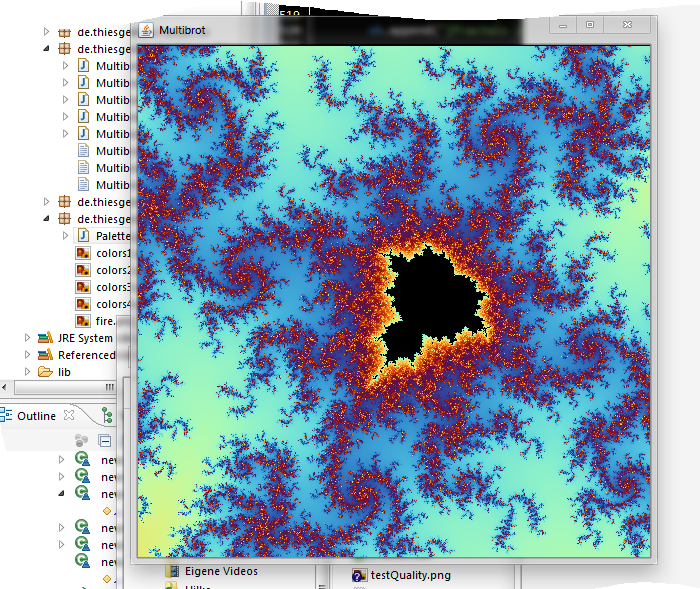
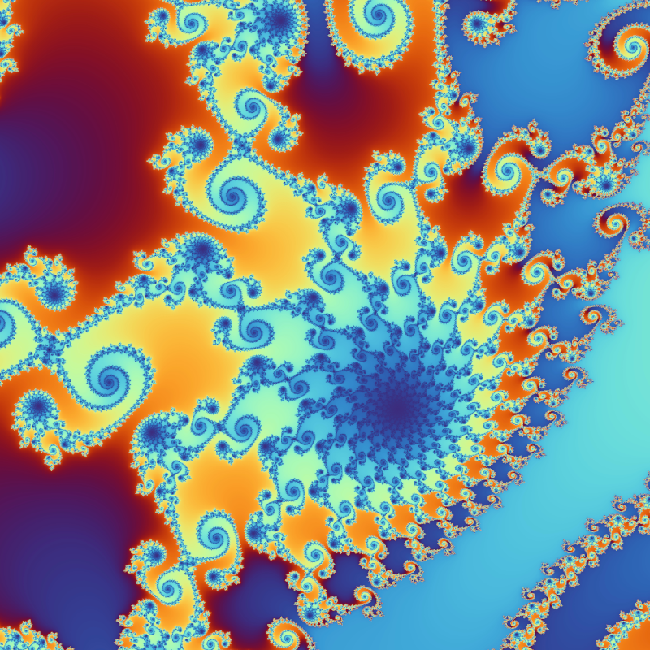

# Fractals

Command line tool to render Fractals. The computations are performed using OpenCL, whereas the rest of the app is written in Java.

Screenshot of the GUI:

Example Exported Fractal (deep zoom into the boundary of the Mandelbrot set):

